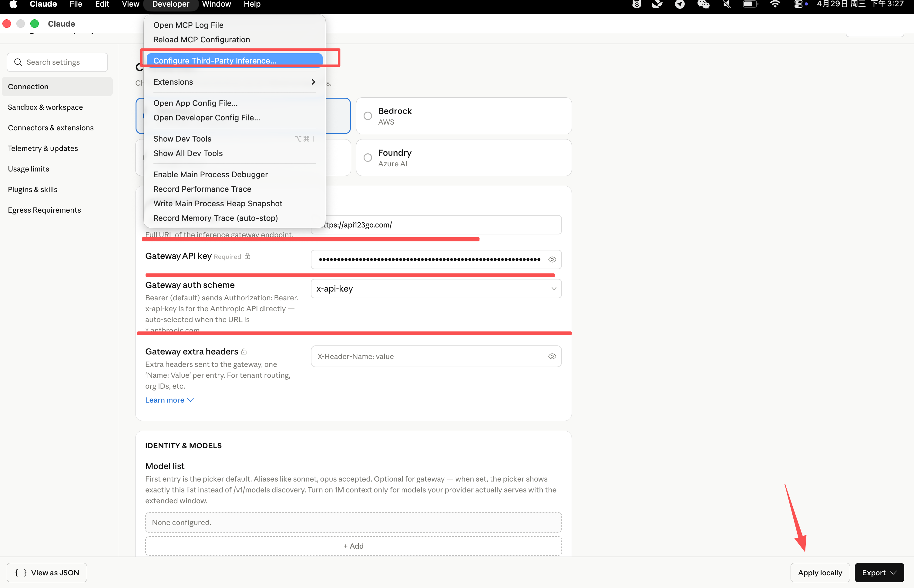
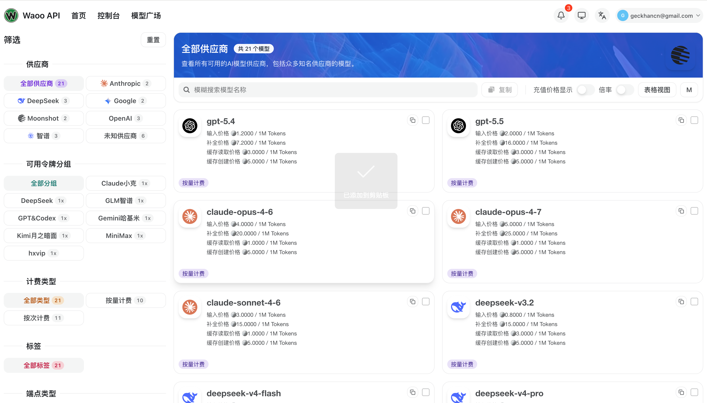
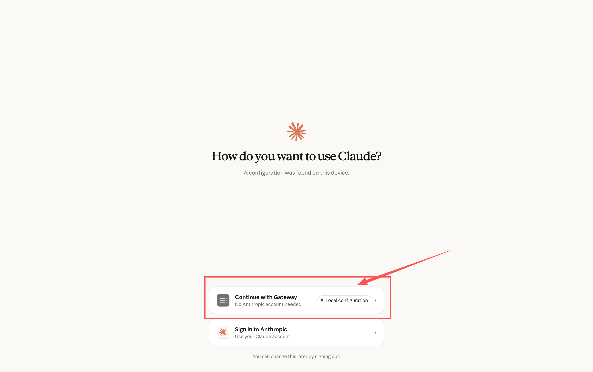

# Claude Desktop：通过开发者模式配置第三方 API

Claude Desktop 支持通过 **Developer Mode（开发者模式）** 配置第三方推理服务。配置完成后，可以在 Claude Desktop 中使用 **Claude Cowork** 和 **Claude Code**，并让它们通过第三方 API、企业 LLM Gateway 或兼容 `/v1/messages` 的推理网关调用模型，例如 `gpt-5.5`。

这种方式适合：

- 使用 Claude Desktop，而不是只使用终端里的 Claude Code CLI
- 希望 Claude Cowork / Claude Code 走第三方 API
- 使用第三方中转服务、企业 LLM Gateway，或兼容 `/v1/messages` 的推理网关
- 想通过桌面端图形界面配置 API 地址、Key、认证方式和模型列表

这里配置的是 **第三方推理后端**，不是普通 Claude 官方账号登录流程。第三方 API 是否能用，取决于服务商是否提供兼容接口、正确的认证方式和可用模型名。

## 1、开启 Developer Mode

首次打开 Claude Desktop 时，如果你准备使用第三方 API 或网关，可以先不要登录 Anthropic 账号。

官方文档说明，配置第三方平台时可以在未登录状态下操作。但在未登录状态下，左上角菜单按钮有时不能直接点击。可以这样打开菜单：

1. 用鼠标点击邮箱输入框
2. 按键盘 `Tab`
3. 焦点跳到左上角菜单按钮后，按 `Enter`

然后进入：

~~~
Help -> Troubleshooting -> Enable Developer Mode
~~~

中文界面对应为：

~~~
帮助 -> 故障排除 -> 启用开发者模式
~~~

点击 **Enable Developer Mode** 后，Claude Desktop 会自动重启。

## 2、配置 Third-Party Inference

重启后，顶部菜单栏会出现新的 **Developer** 菜单。

进入：

~~~
Developer -> Configure Third-Party Inference...
~~~

中文可以理解为：

~~~
开发者 -> 配置第三方推理
~~~

这里就是 Claude Desktop 的第三方推理配置页面。

官方文档中提到，Claude Cowork 的第三方平台集成支持：

- Amazon Bedrock
- Google Cloud Vertex AI
- Azure AI Foundry
- Gateway，也就是公开 `/v1/messages` 的 LLM 网关

如果你使用的是第三方中转服务，或者想接入类似 `gpt-5.5` 这样的第三方模型，通常选择 **Gateway** 方式。

### Gateway 配置字段说明

在图 2 的配置界面中，重点填写下面几项。

| 字段 | 应该填写什么 | 说明 |
| --- | --- | --- |
| Gateway endpoint | 第三方 API 地址 | 填服务商提供的接口地址 |
| Gateway API key | 第三方 API Key | 填你的密钥 |
| Gateway auth scheme | 认证方式 | 常见为 `x-api-key`、`bearer` 或 `auto` |
| Gateway extra headers | 额外请求头 | 如果服务商要求组织 ID、租户 ID 等，可在这里填写 |
| Model list | 模型列表 | 填服务商支持的模型 ID 或别名 |

官方配置字段中，对应关系大致是：

~~~
inferenceProvider=gateway
inferenceGatewayBaseUrl=第三方网关地址
inferenceGatewayApiKey=第三方 API Key
inferenceGatewayAuthScheme=auto / x-api-key / bearer
inferenceGatewayHeaders=额外 HTTP 请求头
inferenceModels=模型列表
~~~

其中最重要的是：

- `inferenceGatewayBaseUrl`：Gateway 模式下的基础 URL
- `inferenceGatewayApiKey`：Gateway 模式下的 API Key
- `inferenceGatewayAuthScheme`：API Key 的发送方式
- `inferenceModels`：模型列表，第一个模型通常会作为默认模型

### 推荐中转服务：Waoo API

如果你需要一个第三方中转服务，可以优先评估 [Waoo API](https://waooapi.com/)。

它的优势是：

- 同时支持原生 GPT 协议和 Claude 协议
- 可以作为 Claude Desktop Gateway 的第三方推理入口
- 价格约为官方直连的 1/10，具体以官网实时价格为准
- 号称量保真，适合需要稳定用量和成本控制的场景

配置时仍然按服务商提供的信息填写 Gateway endpoint、API Key、认证方式和模型名；不要自己猜 URL 路径或模型 ID。

### 以 GPT-5.5 为例

如果你的第三方服务商提供了兼容接口，并且模型名是 `gpt-5.5`，可以按下面思路填写：

~~~
Provider: Gateway
Gateway endpoint: https://你的第三方网关地址
Gateway API key: 你的 API Key
Gateway auth scheme: x-api-key 或 bearer
Model list:
  gpt-5.5
~~~

如果服务商要求这样传密钥：

~~~
x-api-key: YOUR_API_KEY
~~~

则选择：

~~~
x-api-key
~~~

如果服务商要求这样传密钥：

~~~
Authorization: Bearer YOUR_API_KEY
~~~

则选择：

~~~
bearer
~~~

如果不确定，可以先查看服务商文档。不要自己猜 URL 路径、认证方式或模型名。

特别注意：

- API 地址以服务商文档为准
- API Key 不要泄露
- 模型名必须是服务商真实支持的模型 ID
- `gpt-5.5` 这里只是示例，是否可用取决于你的第三方平台

## 3、使用 Local Configuration 启动

配置完成后，回到 Claude Desktop 的启动页面。

如果配置成功，页面会显示类似：

~~~
Continue with Gateway
~~~

并标记为：

~~~
Local configuration
~~~

这表示当前设备已经检测到本地第三方推理配置。

点击 **Continue with Gateway** 即可使用本机配置继续。

进入后，正常情况下你应该能看到和第三方平台模式相关的入口，例如：

- Cowork
- Code

根据官方文档，第三方平台模式下应出现：

- **Cowork 标签**
- **Code 标签**

并且不应出现普通的 **Chat 标签**。

其中：

- **Cowork**：Claude Desktop 中的协作式工作环境
- **Code**：基于终端的编码会话入口
- **Claude Code for Desktop** 的代码会话运行在主机上，不是在 Cowork 虚拟机里运行

## 4、如何确认配置成功

可以按下面顺序检查：

1. 重启 Claude Desktop
2. 确认首页出现 `Continue with Gateway`
3. 确认旁边显示 `Local configuration`
4. 进入 Cowork 或 Code
5. 发起一个简单请求
6. 如果界面有模型选择器，确认模型是你配置的模型，例如 `gpt-5.5`

如果你同时使用终端版 Claude Code CLI，也可以在 CLI 里执行：

~~~
/status
~~~

检查当前模型、Base URL 和认证信息。

不过要注意：Claude Desktop 的 Developer Mode 配置，和终端里的环境变量配置不一定是同一套。Desktop 里配置的是本机桌面端配置；CLI 里通常依赖 `ANTHROPIC_BASE_URL`、`ANTHROPIC_AUTH_TOKEN`、`ANTHROPIC_MODEL` 或 `cc switch`。

## 5、常见问题

### 左上角菜单点不了怎么办？

未登录状态下，菜单按钮有时不能直接点击。

解决方法：

1. 点击邮箱输入框
2. 按 `Tab`
3. 焦点跳到菜单按钮后按 `Enter`
4. 进入 `Help -> Troubleshooting -> Enable Developer Mode`

### 为什么没有 Developer 菜单？

先确认是否已经开启：

~~~
Help -> Troubleshooting -> Enable Developer Mode
~~~

开启后 Claude Desktop 会自动重启。重启后，顶部菜单栏才会出现 `Developer`。

### Gateway endpoint 应该填什么？

填第三方服务商提供的 API 地址。

官方文档中 Gateway 模式面向的是公开 `/v1/messages` 的 LLM 网关。具体地址必须以你的服务商文档为准，不建议自己猜路径。

### Gateway auth scheme 选哪个？

取决于服务商要求。

如果服务商要求：

~~~
Authorization: Bearer YOUR_API_KEY
~~~

选择 `bearer`。

如果服务商要求：

~~~
x-api-key: YOUR_API_KEY
~~~

选择 `x-api-key`。

如果服务商文档明确支持自动识别，可以选择 `auto`。

### Model list 怎么填？

填第三方服务商支持的模型 ID 或别名。

例如：

~~~
gpt-5.5
~~~

如果有多个模型，可以一行一个。通常第一个模型会作为默认模型。

示例：

~~~
gpt-5.5
claude-sonnet-4-6
claude-opus-4-6
~~~

具体可用模型以第三方平台实际支持为准。

### 配置后还是不能用怎么办？

优先检查：

- 是否选择了 Gateway
- Gateway endpoint 是否正确
- API Key 是否有效
- Auth scheme 是否和服务商要求一致
- Model list 里的模型名是否真实存在
- 第三方网关是否兼容 `/v1/messages`
- 保存配置后是否重启了 Claude Desktop

如果仍然失败，可以打开日志进一步排查。官方文档建议：

- macOS：查看控制台日志
- Windows：查看事件查看器

## 6、和其他配置方式的区别

| 方式 | 适合场景 |
| --- | --- |
| Claude Desktop Developer Mode | 在桌面端为 Cowork / Code 配置第三方 API |
| `cc switch` | 在终端中管理多套 Claude Code / Codex / Gemini CLI 配置 |
| 环境变量直配 | 临时或手动配置 Claude Code CLI |
| MDM / `.mobileconfig` / `.reg` | 企业 IT 管理员批量下发配置 |

如果你主要使用 Claude Desktop、Cowork 和桌面端 Code，可以优先使用 Developer Mode。

如果你主要在终端里使用 Claude Code CLI，并且经常切换不同服务商，`cc switch` 会更方便。
